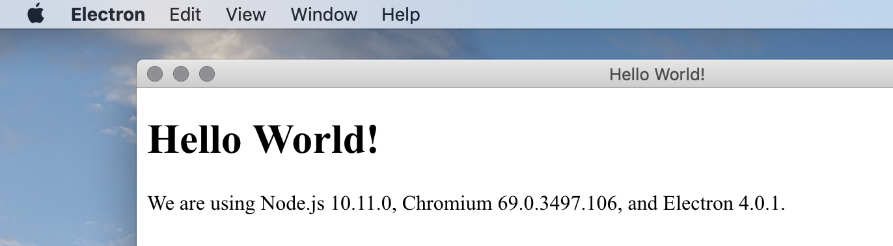

# Electron-menu

provides a default menu for your electron applications, with convenience functions for multiplatform use and i18n.



## Installation

Install using `npm install electron-menu`.

## Usage

Instead of importing Menu from `electron`, import it from `electron-menu`:

``` js
import Menu from 'electron-menu';
// or
const Menu = require('electron-menu');
```

To get a default menu with platform-appropriate menu items and submenus, call Menu like so:
```
Menu();
```

### Optional arguments
Menu has two optional functions you can pass it

* The first argument is the `callback` function, where you can further customise or edit the generated menu.
* The second argument is the `i18n` functionwhere you can supply a function to use for translating the menu items.

```js
Menu(callback, i18n);
```

### The callback function
`callback` receives two arguments:
* The generated menu
* A function that returns `{type: 'separator'}` for convenience.

It expects you to return a menu-like object, either the edited default menu or a new menu.

#### Callback example
To append a menu item to the menu, push an object onto menu and return it:
```js
Menu((defaultMenu, separator) => {

  defaultMenu.push({
    label: 'My custom menu!',
    submenu: [
      {label: 'my first item'},
      separator(),
      {label: 'my second item'},
    ],
  });

  return defaultMenu;
});
```

### The i18n function
The i18n function is applied to the labels of the default menu. There are two things worth mentioning:

* Most items in the default menu are specified by a _role_, so the OS will supply the translation.
* Labels added in the callback function are not translated by this function.

#### Example using i18next
```js
const i18next = require('i18next');

i18next.init({
  /* assumed setup of i18next here */
}).then(function(t) {

  Menu(
    menu => {
      menu.push({
        label: i18next.t('My custom menu!'),
        submenu: [
          {label: i18next.t('my first item')},
          {label: i18next.t('my second item')},
        ],
      }),

      return menu;
    },

    // This function is used to translate the default labels
    i18next.t
  );

});
```

## Multiplatform use
Each item in your menu can have two new properties, `showOn` and `hideOn`. These accept a string or an array of strings that correspond to `process.platform` values such as 'darwin' or 'win32'.

```js
  // this shows the menu item only on macOs
  { showOn: 'darwin' }

  // this hides the menu item on windows and macOs
  { hideOn: ['win32', 'darwin'] }
```

With these, you can adapt your menu to multiple platforms without having to maintain multiple menu templates. See the default template in `electron-menu.js` line 7 for an example of a consolidated template.

You can also add a string or an array of strings as an argument to the separator function: `separator('darwin')`. The given value is interpreted as the value for `showOn`.

#### Example
```js
Menu((defaultMenu, separator) => {

  defaultMenu.push({
    label: "My custom menu!",
    submenu: [
      {
        label: 'This is only shown on macOs',
        showOn: 'darwin',
      },
      separator('darwin'), // this is shown only macOs
      {label:
        'This is hidden on windows'
        hideOn: ['win32']
      },
    ],
  });

  return defaultMenu;
});
```
## License
Electron-menu is ISC licensed.
